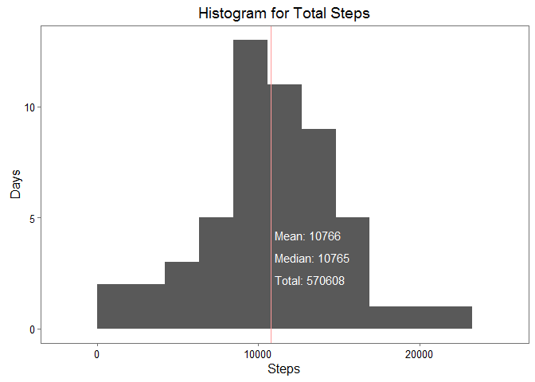
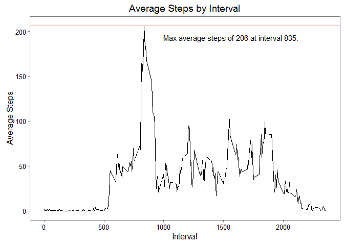
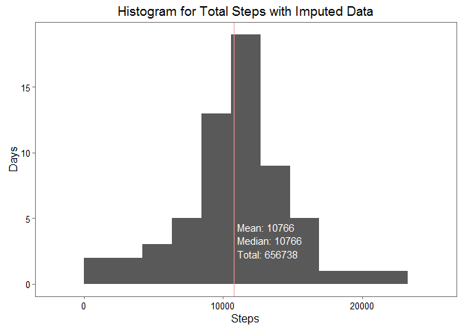
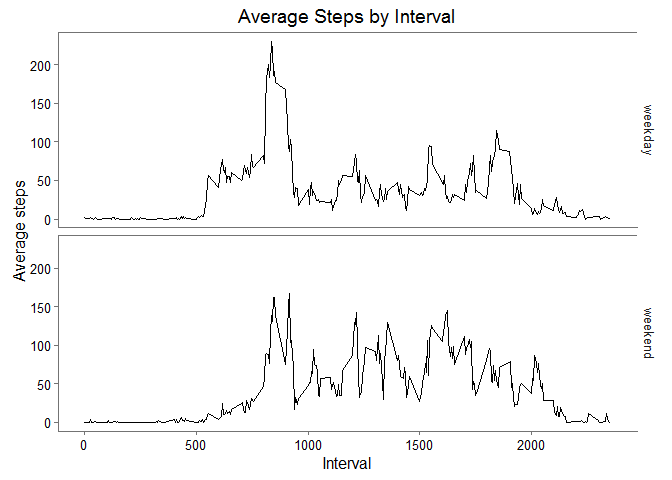

# Reproducible Research: Peer Assessment 1

## Loading and preprocessing the data ##

```r
# Load libraries.
library(dplyr, quietly = TRUE, verbose = FALSE, warn.conflicts = FALSE)
```

```
## Warning: package 'dplyr' was built under R version 3.2.3
```

```r
library(ggplot2, quietly = TRUE, verbose = FALSE, warn.conflicts = FALSE)
```

```
## Warning: package 'ggplot2' was built under R version 3.2.3
```

```r
library(ggthemes, quietly = TRUE, verbose = FALSE, warn.conflicts = FALSE)

# Read the data from CSV file.
activitydata <- tbl_df(read.csv("activity.csv",
                                colClasses = c("integer", 
                                               "Date", 
                                               "integer")))

# Tidy up the variable ordering.
activitydata <- select(activitydata, date, interval, steps)

# Structure of the data.
str(activitydata)
```

```
## Classes 'tbl_df', 'tbl' and 'data.frame':	17568 obs. of  3 variables:
##  $ date    : Date, format: "2012-10-01" "2012-10-01" ...
##  $ interval: int  0 5 10 15 20 25 30 35 40 45 ...
##  $ steps   : int  NA NA NA NA NA NA NA NA NA NA ...
```

```r
# Head of the data.
head(activitydata)
```

```
## Source: local data frame [6 x 3]
## 
##         date interval steps
##       (date)    (int) (int)
## 1 2012-10-01        0    NA
## 2 2012-10-01        5    NA
## 3 2012-10-01       10    NA
## 4 2012-10-01       15    NA
## 5 2012-10-01       20    NA
## 6 2012-10-01       25    NA
```

## What is mean total number of steps taken per day? ##

```r
# Remove incomplete observations.
activitydatasubset <- activitydata[complete.cases(activitydata),]

# Get the total steps for each day.
activitydatasubset <- activitydatasubset %>%
    select(date, steps) %>%
    group_by(date) %>%
    summarise_each(funs(sum))

# Create histogram.
p <- ggplot(data = activitydatasubset, 
            aes(steps)) +
    geom_histogram(bins = 10) +
    ggtitle("Histogram for Total Steps") +
    xlab("Steps") +
    ylab("Days") +
    theme_few() +
    geom_vline(xintercept = mean(activitydatasubset$steps), colour = "#FF9999") +
    annotate("text", 
             label = paste("Mean:", round(mean(activitydatasubset$steps), 0)), 
             x = 11000, 
             hjust = 0, 
             y = 4, 
             vjust = 0,
             colour = "white") +
    annotate("text", 
             label = paste("Median:", round(median(activitydatasubset$steps), 0)), 
             x = 11000,
             hjust = 0,
             y = 3,
             vjust = 0,
             colour = "white") +
    annotate("text", 
             label = paste("Total:", round(sum(activitydatasubset$steps), 0)), 
             x = 11000,
             hjust = 0,
             y = 2,
             vjust = 0,
             colour = "white")

print(p)
```

 

## What is the average daily activity pattern? ##

```r
# Remove incomplete observations.
activitydatasubset <- activitydata[complete.cases(activitydata),]

# Group by interval and then average the steps.
activitydatasubset <- activitydatasubset %>%
    select(interval, steps) %>%
    group_by(interval) %>%
    summarise_each(funs(mean))

# Create plot.
p <- ggplot(data = activitydatasubset, 
            aes(x = interval, y = steps)) +
    geom_line() +
    ggtitle("Average Steps by Interval") +
    xlab("Interval") +
    ylab("Average Steps") +
    theme_few() +
    geom_hline(yintercept = max(activitydatasubset$steps), colour = "#FF9999") +
    annotate("text", 
             label = paste(sep = "", 
                           "Max average steps of ", 
                           round(max(activitydatasubset$steps), 0),
                           " at interval ",
                           activitydatasubset[which.max(activitydatasubset$steps),]$interval, "."),
             x = 1000, 
             hjust = 0, 
             y = 190, 
             vjust = 0) 

print(p)
```

 

## Imputing missing values ##

```r
# Calculate the number of incomplete cases.
incompleteCases <- nrow(activitydata) - sum(complete.cases(activitydata))
print(incompleteCases)
```

```
## [1] 2304
```

```r
# Remove incomplete observations.
activitydatasubset <- activitydata[complete.cases(activitydata),]

# Group by interval and then average the steps.
activitydatasubset <- activitydatasubset %>%
    select(interval, steps) %>%
    group_by(interval) %>%
    summarise_each(funs(mean))

# Split out the complete and incomplete cases.
activitydataCompleteCases <- activitydata[complete.cases(activitydata),]
activitydataIncompletedCases <- activitydata[!complete.cases(activitydata),]

# Remove the steps column, as all the values are missing.
activitydataIncompletedCases <- select(activitydataIncompletedCases, date, interval)

# Join the average steps value by matching the interval.
activitydataIncompletedCases <- left_join(activitydataIncompletedCases, activitydatasubset, by = "interval")

# Bind the rows back together.
activitydataImputed <- rbind(activitydataCompleteCases, activitydataIncompletedCases)

# Arrange the rows.
activitydataImputed <- arrange(activitydataImputed, date, interval)

# Get the total steps for each day.
activitydataImputed <- activitydataImputed %>%
    select(date, steps) %>%
    group_by(date) %>%
    summarise_each(funs(sum))

# Create histogram.
p <- ggplot(data = activitydataImputed, 
            aes(steps)) +
    geom_histogram(bins = 10) +
    ggtitle("Histogram for Total Steps with Imputed Data") +
    xlab("Steps") +
    ylab("Days") +
    theme_few() +
    geom_vline(xintercept = mean(activitydataImputed$steps), colour = "#FF9999") +
    annotate("text", 
             label = paste("Mean:", round(mean(activitydataImputed$steps), 0)), 
             x = 11000, 
             hjust = 0, 
             y = 4, 
             vjust = 0,
             colour = "white") +
    annotate("text", 
             label = paste("Median:", round(median(activitydataImputed$steps), 0)), 
             x = 11000,
             hjust = 0,
             y = 3,
             vjust = 0,
             colour = "white") +
    annotate("text", 
             label = paste("Total:", round(sum(activitydataImputed$steps), 0)), 
             x = 11000,
             hjust = 0,
             y = 2,
             vjust = 0,
             colour = "white")

print(p)
```

 

Data | Total Steps | Mean Steps | Median Steps | Comment
-----|-------------|------------|--------------|--------
Original | 570,608 | 10,766 | 10,765 |
Imputed | 656,738 | 10,766 | 10,766 | Significant increase in total steps, mean is unchanged, median has increased only by 1.

## Are there differences in activity patterns between weekdays and weekends? ##

```r
# Split out the complete and incomplete cases.
activitydataCompleteCases <- activitydata[complete.cases(activitydata),]
activitydataIncompletedCases <- activitydata[!complete.cases(activitydata),]

# Remove the steps column, as all the values are missing.
activitydataIncompletedCases <- select(activitydataIncompletedCases, date, interval)

# Join the average steps value by matching the interval.
activitydataIncompletedCases <- left_join(activitydataIncompletedCases, activitydatasubset, by = "interval")

# Bind the rows back together.
activitydataImputed <- rbind(activitydataCompleteCases, activitydataIncompletedCases)

# Arrange the rows.
activitydataImputed <- arrange(activitydataImputed, date, interval)

# Create a vector for the weekday of each date.
daytype <- weekdays(activitydataImputed$date)

# Replace the day string.
daytype <- gsub("Monday", "weekday", daytype, fixed = TRUE)
daytype <- gsub("Tuesday", "weekday", daytype, fixed = TRUE)
daytype <- gsub("Wednesday", "weekday", daytype, fixed = TRUE)
daytype <- gsub("Thursday", "weekday", daytype, fixed = TRUE)
daytype <- gsub("Friday", "weekday", daytype, fixed = TRUE)
daytype <- gsub("Saturday", "weekend", daytype, fixed = TRUE)
daytype <- gsub("Sunday", "weekend", daytype, fixed = TRUE)

# Convert to factor vector.
daytype <- as.factor(daytype)

# Column bind the data and daytype.
activitydataImputedPlusDaytype <- tbl_df(cbind(activitydataImputed, daytype))

# Prepare data for plotting.
activitydataImputedPlusDaytype <- activitydataImputedPlusDaytype %>%
    select(daytype, interval, steps) %>%
    group_by(daytype, interval) %>%
    summarise_each(funs(mean))

# Create the plot.
p <- ggplot(data = activitydataImputedPlusDaytype, 
            aes(x = interval, y = steps)) +
    geom_line() +
    ylab("Average steps") +
    xlab("Interval") +
    ggtitle("Average Steps by Interval") +
    theme_few() +
    facet_grid(daytype ~ .)
    
print(p)
```

 
